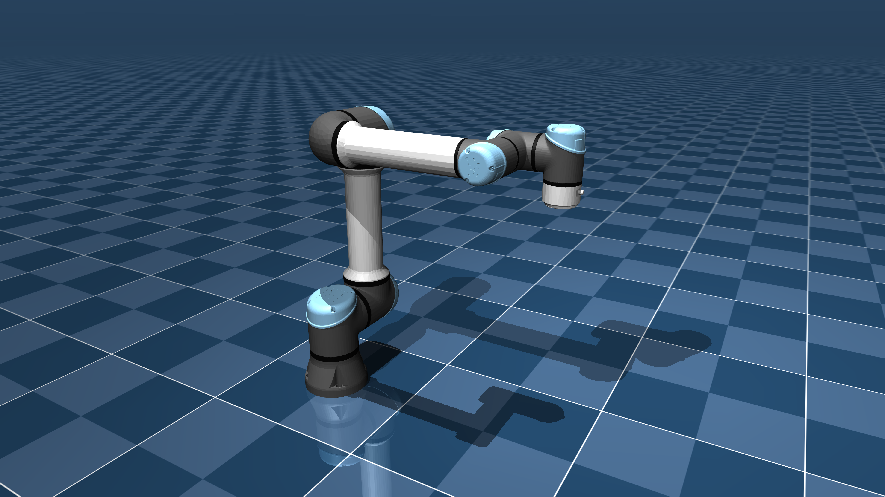

# Universal Robots UR5e Description (MJCF)

> [!IMPORTANT]
> Requires MuJoCo 2.3.3 or later.

## Changelog

See [CHANGELOG.md](./CHANGELOG.md) for a full history of changes.

## Overview

This package contains a simplified robot description (MJCF) of the
[UR5e](https://www.universal-robots.com/products/ur5-robot/) developed by
[Universal Robots](https://www.universal-robots.com/). It is derived from the
[publicly available URDF
description](https://github.com/ros-industrial/universal_robot/tree/kinetic-devel/ur_e_description).

  

### URDF → MJCF derivation steps

1. Converted the DAE [mesh
   files](https://github.com/ros-industrial/universal_robot/tree/kinetic-devel/ur_e_description/meshes/ur5e/visual)
   to OBJ format using [Blender](https://www.blender.org/).
2. Processed `.obj` files with  [`obj2mjcf`](https://github.com/kevinzakka/obj2mjcf).
3. Added `<mujoco> <compiler discardvisual="false"/> </mujoco>` to the URDF's
   `<robot>` clause in order to preserve visual geometries.
4. Loaded the URDF into MuJoCo and saved a corresponding MJCF.
5. Added a tracking light to the base.
6. Manually edited the MJCF to extract common properties into the `<default>` section.
7. Added position-controlled actuators. Max joint torque values were taken from
   [here](https://www.universal-robots.com/articles/ur/robot-care-maintenance/max-joint-torques/).
8. Added home joint configuration as a `keyframe`.
9. Manually designed collision geometries.
10. Added `scene.xml` which includes the robot, with a textured ground plane, skybox and haze.

## Attached gripper

This model has been extended with a [Robotiq 2F-85](https://robotiq.com/products/2f85-140-adaptive-robot-gripper)
gripper, mounted at the wrist `attachment_site`. The gripper description (MJCF and
meshes) is from [MuJoCo Menagerie](https://github.com/google-deepmind/mujoco_menagerie)
by Google DeepMind and lives in [2f85/](2f85), released under a separate
[BSD-2-Clause License](2f85/LICENSE). Its bodies, assets, contacts, tendon, equality
constraints, and the `fingers_actuator` are merged into [ur5e.xml](ur5e.xml).

## RGB-D cameras

The model carries two RGB-D cameras, the standard pairing for manipulation:

- **`wrist_rgbd` (eye-in-hand)**, modeled on the [Intel RealSense
  D435i](https://www.intelrealsense.com/depth-camera-d435i/), mounted on the rigid gripper
  base in [ur5e.xml](ur5e.xml). It sits on the flat side of the gripper with a ~12 cm
  standoff and is aimed at the grasp point, so the two fingers frame the view and an object
  held between them is visible. `fovy` is 58 deg (D435 depth vertical FOV). A 90x25x25 mm
  box (`d435i_housing`) stands in for the physical camera body.
- **`scene_rgbd` (eye-to-hand)**, a world-fixed overview camera defined in
  [scene.xml](scene.xml). It sits on an elevated 3/4 stand in front of the robot, aimed at
  the centre of the reachable workspace, and frames the table and the arm reaching into it.

In MuJoCo, RGB-D is read at render time: the colour buffer gives RGB and the depth buffer
gives metric depth from the same camera. See the capture demos in
[../tests/test_wrist_rgbd.py](../tests/test_wrist_rgbd.py) and
[../tests/test_pick_and_place.py](../tests/test_pick_and_place.py).

## Pick-and-place scenes

There are two manipulation scenes, both sharing the same six graspable objects (cubes,
cuboids, and cylinders) defined in [objects.xml](objects.xml). The objects sit at fixed,
reachable poses with varied orientations, and both scenes reset to the `start` keyframe
(defined in `objects.xml`), not `home`, so the object DOFs initialise correctly.

- [pick_and_place.xml](pick_and_place.xml): objects on the floor. Includes
  [scene.xml](scene.xml) (robot, gripper, cameras, ground plane) plus `objects.xml`.
- [pick_and_place_tables.xml](pick_and_place_tables.xml): a three-table cell. The robot is
  on a pedestal table, the objects are on a pick table in front, and an empty drop table
  sits to the right for placing picked objects. All table tops are at z=0 (the robot's
  mounting height), with the ground plane dropped to z=-0.5, so reach geometry is identical
  to the floor scene and every table sits inside the UR5e's ~0.85 m reach.

## License

The UR5e model is released under a [BSD-3-Clause License](LICENSE). The bundled
Robotiq 2F-85 gripper is released under a [BSD-2-Clause License](2f85/LICENSE).
